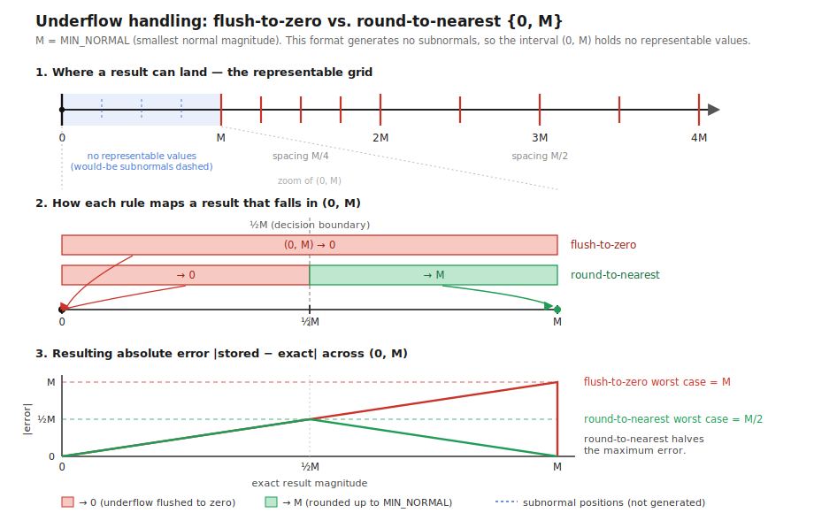
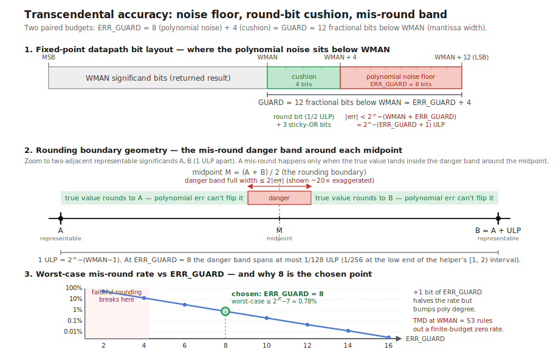

# Zubax Kulibin floating point

A small and FPGA-friendly floating point format that is similar to IEEE 754 but intentionally omits support for NaN,
subnormals, exceptions, and rounding modes other than round-to-nearest, ties-to-even (RNTE).
Only one canonical positive zero representation exists.

The bit layout is identical to IEEE 754: sign, exponent, and the significand with the MSb omitted.

See how ZKF beats other floating-point libraries in <https://zubax.github.io/fpga-floating-point-eval>.

## Usage

`zkf` ships on PyPI and is equally usable by direct RTL copy-paste; both paths are first-class.

- **As a Python dependency** (the main use case for projects that generate RTL): `pip install zkf`, then
  `zkf.get_rtl()` returns every Verilog module as a `{path: source}` mapping, keyed by path relative to `zkf/rtl/`
  (e.g. `zkf_add.v`, `_tables/_zkf_exp2_m18.v`). `import zkf` is pure standard library; the bit-exact value model
  (`ZkfFormat`, `Zkf`, …) is re-exported from the package root and equals the RTL output bit-for-bit, so it doubles
  as a golden emulator. The optional oracles in `zkf.oracle` need `pip install zkf[oracle]` (numpy/mpmath).
- **By copy-paste / submodule**: the `zkf_*` modules under `zkf/rtl/` implement the operators; drop the directory
  into your project tree. Private helpers are named `_zkf_*`.

Everything else in the repo is verification scaffolding and is not a shippable artifact.

Most modules are zero-bubble throughput-1 pipelines; only those that implement computationally heavy functions
are FSM-based and offer limited throughput.
The zero-bubble ones offer the conventional `in_valid`/`out_valid` interface;
those with limited throughput extend it with `in_ready`/`out_ready` handshake.

All modules have fixed data-independent latency known at elaboration time.

The two main parameters are WEXP and WMAN setting the bit width of the biased exponent and the significand;
the most significant bit of the significand is not stored, but there is a sign bit,
so the total bit width is simply WFULL=WEXP+WMAN.

The modules are entirely self-contained -- no external dependencies; simply drag-and-drop the directory into your project.
There are private helper modules named `_zkf_*`;
they are not supposed to be instantiated by the user but the public modules depend on them.
They do not offer any of the guarantees that are valid for the public modules.

Some of the simple combinational modules may produce non-canonical outputs; this does not affect compatibility with
other modules since they always canonicalize inputs, but it is worth noting.

### Tuning knobs

Most modules provide pipelining knobs, like output register selection, internal registers, etc,
to enable tuning for the target chip. Common options seen in most modules are:
`STAGE_INPUT` -- latch inputs (no combinational paths at the input) plus optional dummy stages
(helps in routing-congested designs);
`STAGE_OUTPUT` -- registered outputs (no combinational paths at the output);
others control various computation stages.

Some modules offer to split long multiplication into several stages via `STAGE_PRODUCT`;
usually this only helps if the operands exceed the width of the chip's DSP tile inputs.
The value, as with any other STAGE knob, is the number of extra cycles in the multiplier and also a manual split knob:
0 - no extra stages and no manual splitting, let the synthesizer arrange the circuit automatically in a single cycle.
1 - same as above but adds an operand capture register stage before the multiplier, which allows the synthesizer
to place a latch immediately before the DSP tile (or several if auto-split is happening) and in some cases (e.g. Vivado)
retime multiplication across two stages.
2/3 - manually split the product into a 2x2/3x3 grid of sub-products (all use the operand-capture stage), summing
the partial products in as many registered reduction stages.
4 - same 3x3 grid as 3, but the final partial-product reduction is itself pipelined into two registered stages.

Some modules that use multiplication offer the optional `WMULTIPLIER` parameter that defaults to zero,
but it can be set by the user to the argument width of the DSP tile multipliers available on-chip.
This enables the library to optimally split wide multiplication (when it doesn't fit into a single DSP tile)
across several tiles; this is significant when wide operands over 2x the native argument width are involved.
If not specified, the library will split wide multiplication into equal-width operands, which is not always optimal.
Common multiplier operand widths frequently found in FPGAs are 16, 18, and 24 bits.

Every sequential module exposes a `LATENCY` parameter. It is not a tuning knob; changing it does not change the hardware.
Its purpose is to let a latency-sensitive consumer pin down the latency it relies on: compute the value locally and pass it in.
The module fails synthesis if the supplied value disagrees with its real stage count, so an internal change that shifts
the latency cannot slip through unnoticed -- the build breaks and points you at the stale constant.
Pair `LATENCY` with `zkf_pipe` to delay your own control or sideband signals so they land with the operator's output.
A zero `LATENCY` is a special value indicating that the latency should not be checked (the default).

The `LATENCY` value is a sum of some constant baseline number of stages,
plus optionally some WMAN-dependent stage count, plus the sum of all `STAGE_*` values (all zero by default).

Generated lookup table ROMs are plain initialized Verilog arrays. They expose `ZKF_ATTRIBUTE_ROM_PRE` and
`ZKF_ATTRIBUTE_ROM_POST` as optional hooks around the ROM declaration for tool-specific attributes.
They may require overriding to enable correct ROM inference depending on the target chip/flow.

### Catalogue

Notation: ⇝ - combinational, ⇻ - sequential, (nothing) - can be either depending on the selected `STAGE_`s;
II - initiation interval (cycles between accepting new inputs, reciprocal of cycle throughput;
1 for zero-bubble pipelined modules).

| Module                |   | II      | Function                                                       | Remarks                     |
|-----------------------|---|---------|----------------------------------------------------------------|-----------------------------|
| `zkf_abs`             | ⇝ |         | Absolute value.                                                |                             |
| `zkf_neg`             | ⇝ |         | Negation.                                                      | May produce -0 (non-canonical)|
| `zkf_is_finite`       | ⇝ |         | True iff `x` is finite.                                        |                             |
| `zkf_saturate`        | ⇝ |         | Replace ±∞ with the nearest finite of the same sign.           | Does not canonicalize       |
| `zkf_cmp`             | ⇻ | 1       | Compare two values.                                            |                             |
| `zkf_sort`            | ⇻ | 1       | Min and max of two values.                                     | Does not canonicalize       |
| `zkf_add`             | ⇻ | 1       | `a + b`.                                                       |                             |
| `zkf_addsub`          | ⇻ | 1       | `a + b` or `a − b` selected by `op_sub` (trivial wrapper).     |                             |
| `zkf_mul`             | ⇻ | 1       | `a⋅b`.                                                         |                             |
| `zkf_mul_ilog2`       | ⇻ | 1       | `a⋅2^k` for signed integer k (ldexp/scalbn).                   |                             |
| `zkf_mul_ilog2_const` | ⇻ | 1       | `a⋅2^K` for an elaboration-time signed integer `K`.            | Const wins some fabric area |
| `zkf_div`             | ⇻ | 1       | `a ÷ b`; flags divide-by-zero.                                 |                             |
| `zkf_fma`             | ⇻ | 1       | `(a⋅b) + c` fused multiply-add, high precision, rounded once.  | Larger than separate mul->add; non-finite handling follows mul->add.|
| `zkf_from_int`        | ⇻ | 1       | Cast signed two's-complement integer to float.                 |                             |
| `zkf_to_int`          | ⇻ | 1       | Cast float to signed two's-complement integer with saturation. | RNTE                        |
| `zkf_resize`          |   | 1       | Cast between different float formats.                          |                             |
| `zkf_round`           |   | 1       | Round to integer in same format: RNTE/floor/ceil/trunc.        | Outputs float; also see `zkf_to_int`|
| `zkf_exp2`            | ⇻ | 1       | `2^x`                                                          | Faithful rounding, see below|
| `zkf_log2`            | ⇻ | 1       | `log2(x)`; `domain_error` if `x<0`, `pole` if `x=0`.           | Faithful rounding, see below|
| `zkf_sincos`          | ⇻ |latency+1| `sin(2π⋅x)`, `cos(2π⋅x)` for `x` in turns; exposes `quadrant`. | Faithful rounding, see below|
| `zkf_atan2`           | ⇻ |latency+1| `atan2(y,x)` in turns ∈ (−0.5,0.5] and `hypot(y,x)`.           | Faithful rounding, see below|
| `zkf_pipe`            |   | 1       | Delay line of N register stages, W bits each.                  | No-op                       |

#### Notably absent functions

The transcendental/trigonometric functions offer high accuracy ≤1 ULP. This is desirable for many applications,
but often one would accept a lower accuracy (common in control systems) to save fabric and/or cycle latency.
There is interest in extending the module set with approximate trans/trig functions built on a simple
piecewise function approximation kernel that offer II=1, low cycle latency, and low fabric usage:
`zkf_exp2_approx`, `zkf_sincos_approx`, etc.

### Derived functions

The basic modules available enable simple computation of a huge variety of derived functions; examples follow.
Bare angle functions follow the usual radian convention; helpers suffixed `_turns` expose ZKF's native turn
representation.

    sin_turns(x), cos_turns(x)  = zkf_sincos(x)                     ; x in turns
    atan2_turns(y,x)            = zkf_atan2(y, x)                   ; angle in turns ∈ (−0.5,0.5]
    atan_turns(x)               = atan2_turns(x, 1)

    normalize_angle(x)          = x − 2π⋅floor((x + π) / (2π))      ; [-π,+π)
    normalize_angle_turns(t)    = t − floor(t + 0.5)                ; [-0.5,+0.5)

    INV_TAU = 1 / (2π)
    radians_to_turns(x) = x⋅INV_TAU

    sin(x), cos(x)      = sin_turns(radians_to_turns(x)), cos_turns(radians_to_turns(x))
    atan2(y,x)          = 2π⋅atan2_turns(y, x)

    exp(x)              = exp2(x⋅log2(e))
    ln(x)               = log2(x) / log2(e)
    log10(x)            = log2(x) / log2(10)
    log_b(x)            = log2(x) / log2(b)     ; x>0, b>0, b≠1
    pow(a,b)            = exp2(b⋅log2(a))       ; real-valued identity for a>0
    recip(x)            = 1 / x
    sqrt(x)             = exp2(log2(x)⋅2^-1)    ; x≥0; see zkf_mul_ilog2_const
    rsqrt(x)            = exp2(log2(x)⋅-2^-1)   ; x>0; avoids division
    cbrt(x)             = sign(x)⋅exp2(log2(abs(x)) / 3)

    tan(x)              = sin(x) / cos(x)
    atan(x)             = atan2(x, 1)
    asin(x)             = atan2(x, sqrt(1 − x⋅x))      ; x ∈ [-1,+1]
    acos(x)             = atan2(sqrt(1 − x⋅x), x)      ; x ∈ [-1,+1]
    h                   = max(abs(x), abs(y))
    hypot(x,y)          = h=0 ? 0 : !is_finite(h) ? +∞ : h⋅sqrt((x/h)⋅(x/h) + (y/h)⋅(y/h))

    min(a,b), max(a,b)  = sort(a,b)
    clamp(x, lo, hi)    = min(max(x, lo), hi)
    lerp(a,b,t)         = fma(t, b − a, a)
    deadzone(x,d)       = sign(x)⋅max(abs(x) − d, 0)
    smoothstep(t)       = t⋅t⋅(3 − 2⋅t); where t is clamped to [0,1]

    dot(a,b)            = sum_i a[i]⋅b[i]                               ; use zkf_fma chains
    norm2(x)            = dot(x, x)
    norm(x)             = sqrt(norm2(x))
    normalize(x)        = x⋅rsqrt(norm2(x) + ε)
    distance(a,b)       = norm(a − b)
    distance_2d(a,b)    = hypot(a.x − b.x, a.y − b.y)

    db_power(x)         = 10⋅log10(x)                                   ; x>0
    db_amplitude(x)     = 20⋅log10(abs(x))                              ; x≠0
    power_from_db(x)    = exp2(x⋅log2(10) / 10)
    amp_from_db(x)      = exp2(x⋅log2(10) / 20)

    sinc(x)             = sin(π⋅x) / (π⋅x)                              ; normalized, sinc(0)=1
    rms(x)              = sqrt(mean(x⋅x))
    ema(y,x,a)          = fma(a, x − y, y)

    complex_abs(re,im)  = hypot(re, im)
    arg(re,im)          = atan2(im, re)
    arg_turns(re,im)    = atan2_turns(im, re)
    unit_complex(t)     = (cos(t), sin(t))                              ; principal counterpart of arg()
    polar(r,t)          = (r⋅cos(t), r⋅sin(t))                          ; r≥0
    complex_mul((ar,ai),(br,bi)) = (ar⋅br − ai⋅bi, ar⋅bi + ai⋅br)
    rotate2(x,y,t)      = (x⋅cos(t) − y⋅sin(t), x⋅sin(t) + y⋅cos(t))

    relu(x)             = max(x, 0)
    leaky_relu(x)       = x ≥ 0 ? x : α⋅x
    hard_sigmoid(x)     = clamp(α⋅x + β, 0, 1)
    hard_swish(x)       = x⋅hard_sigmoid(x)

    sigmoid(x)          = 1 / (1 + exp2(−x⋅log2(e)))
    tanh(x)             = 2⋅sigmoid(2⋅x) − 1
    softplus(x)         = max(x, 0) + log2(1 + exp2(−abs(x)⋅log2(e))) / log2(e)
    silu(x)             = x⋅sigmoid(x)

    m                   = max_i x[i]
    logsumexp(x[])      = m + log2(sum_i exp2((x[i] − m)⋅log2(e))) / log2(e)
    softmax_i(x[])      = exp2((x[i] − m)⋅log2(e)) / sum_j exp2((x[j] − m)⋅log2(e))
    layer_norm(x)       = (x − mean(x))⋅rsqrt(var(x) + ε)

And so on.

Generic floating-point remainder/modulo computation is not included because the general solution requires iterative
range reduction which maps poorly onto fixed-latency FPGA cores; instead, one can build the iterative solver using
the existing basic operators: zkf_fma, zkf_div, etc.

## Semantics

Differences from IEEE 754: no NaN, no subnormals (exponent 0 always encodes +0; finite magnitudes in `(0, min_normal/2)`
round to +0; magnitudes in `[min_normal/2, min_normal)` round to signed min_normal), no −0, no exceptions,
overflow produces ±∞.

Infinity cases that would be NaN in IEEE 754:

| Expression          | Result                         |
|---------------------|--------------------------------|
| +∞ + −∞             | +0                             |
| 0⋅±∞                | +0                             |
| 0 ÷ 0               | +0                             |
| ±∞ ÷ ±∞             | +0                             |

Non-NaN infinity cases (same intent as IEEE 754):

| Expression          | Result                         |
|---------------------|--------------------------------|
| finite≠0 ÷ 0        | ±∞  (sign = sign of dividend)  |
| ±∞ ÷ 0              | ±∞  (sign = sign of dividend)  |
| finite ÷ ±∞         | +0                             |
| ±∞⋅±∞               | ±∞  (sign = signs XOR)         |
| finite≠0⋅±∞         | ±∞  (sign = signs XOR)         |

The subnormal round-to-nearest behavior is illustrated below, compared against the basic flush to zero for any value
below the min normal. The timing/area cost of both approaches is approximately equivalent while the rounding method
halves the worst-case error.

ZKF only has a single canonical zero representation -- the positive zero. However, it is not an error to pass a
negative zero as an operand; the sign bit of a zero operand is simply ignored. This relaxation enables simplification
of certain basic operators.

### Accuracy of the transcendental functions

The exp2 and log2 transcendentals deliver faithful rounding (≤1 ULP guaranteed) with a 0.5 ULP correctly-rounded target,
enforced by two paired headroom budgets.

The per-segment Chebyshev fit + truncating Horner is sized to clear `< 2^-(WMAN+ERR_GUARD)` relative error with
ERR_GUARD = 8, i.e. between `2^-(ERR_GUARD+1) = 1/512` and `2^-ERR_GUARD = 1/256` of an ULP absolute across the
helper's `[1, 2)` interval — small enough that the round bit is structurally trustworthy,
so faithful rounding is automatic.

A mis-round against round-to-nearest-ties-to-even is possible only when the true value lies within `≈2^-(ERR_GUARD-1)`
ULP of a midpoint between adjacent representable values, bounding the worst-case mis-round rate at `≈2^-7 ≈ 0.8%`;
raising ERR_GUARD by one bit halves that rate at the cost of bumping the polynomial degree (and a Horner stage)
at some WMAN, but the Table-Maker's Dilemma rules out correctly-rounded-everywhere at WMAN = 53 regardless of budget,
so the 0.5 ULP target is best-effort while the ≤ 1 ULP bound is the hard contract.

The fixed-point datapath then carries GUARD = ERR_GUARD + 4 = 12 extra fractional bits below the WMAN significand
— eight bits of polynomial-noise headroom plus four bits to host the guard/round/sticky positions and absorb the
truncating Horner's LSB noise — which is the smallest split that keeps the round bit clear of the noise floor under
truncating arithmetic; widening it further has no accuracy benefit and just pays in DSP/LUT/FF area.

The trigonometric modules (sincos, atan2) carry the same ≤1 ULP contract and are built on a shared CORDIC core instead
of polynomials, with post-refinement to achieve the accuracy target trading a few DSP tiles for a lower cycle latency.

**ATTENTION:** To achieve good results, it is essential to ensure that the look-up tables used by the
transcendental/trigonometric operators are correctly mapped to ROM. If you see unreasonable fabric usage and bad
timings, check your synthesis settings first, and if necessary override `ZKF_ATTRIBUTE_ROM_PRE` and
`ZKF_ATTRIBUTE_ROM_POST`.

## Sizing the exponent and the significand (WEXP/WMAN)

WEXP can be chosen freely depending on the required range, while WMAN is sensitive to the chip's DSP capabilities
and thus requires careful selection to achieve best resource utilization.

|WMAN |≈ε (interval)| Description                                                                                 |
|-----|-------------|---------------------------------------------------------------------------------------------|
|  16 | 3.052e-05   | DSP tiles in Lattice iCE40 and similar                                                      |
|  18 | 7.629e-06   | Classic FPGA DSP width, very common: ECP5, PolarFire, Trion, many Intel modes, etc.         |
|  24 | 1.192e-07   | IEEE 754 binary32; also fits Versal DSP58's 27x24 asymmetric multiplier side                |
|  27 | 1.490e-08   | Intel/Altera variable-precision DSPs                                                        |
|  32 | 4.657e-10   | 2x16                                                                                        |
|  36 | 2.910e-11   | 2x18 (very common) or native Intel/Altera 36x36-style variable-precision mode               |
|  48 | 7.105e-15   | 2x24 or 3x16; with an 8-bit exponent amounts to 7 bytes exactly                             |
|  53 | 2.220e-16   | IEEE 754 binary64                                                                           |

Narrower WMAN is rarely practical for computation due to low precision and fast error accumulation,
although they can still be useful for storage/exchange. One notable exception is neural networks though.

### WMAN=18

An FPGA-friendly format because modern DSP-enabled FPGAs often implement 18x18 bit multipliers, which means that a
narrower mantissa is unlikely to save much resources or nontrivially improve timings as long as hardware multipliers
are used.

One can stay within 24 bits total by choosing WEXP=6:

    WEXP=6 WMAN=18 WFRAC=17 WFULL=24 BIAS=31
    lowest     = 1/1073741824 ≈ 9.313e-10
    max        = 0xFFFF_C000  ≈ 4.295e+09
    ε          = 1/131072     ≈ 7.629e-06

### WMAN=36

Similar to the above, WMAN=36 is efficient on common FPGAs because it maps multiplication to four 18x18 DSP slices.
This is often a better fit for intermediate result representation to avoid error accumulation --
the precision lands halfway between IEEE 754 binary64 and binary32.

Usually, on an 18x18 DSP chip, going even a single bit higher causes f_max to tank dramatically while area explodes.
Thus this is likely to be the optimal choice for a large number of applications.

Using binary32-compatible exponent WEXP=8, 44 bits total (5.5 bytes):

    WEXP=8 WMAN=36 WFRAC=35 WFULL=44 BIAS=127
    lowest     = 1/85070591730234615865843651857942052864 ≈ 1.175e-38
    max        = 0xFFFFFFFF_F0000000_00000000_00000000    ≈ 3.403e+38
    ε          = 1/34359738368                            ≈ 2.910e-11

### IEEE 754-like

ZKF offers limited compatibility with IEEE 754 so while it can match the bit layout,
not all states are mappable between the formats.

- WEXP=5  WMAN=11: IEEE 754 binary16-like
- WEXP=8  WMAN=24: IEEE 754 binary32-like
- WEXP=11 WMAN=53: IEEE 754 binary64-like
